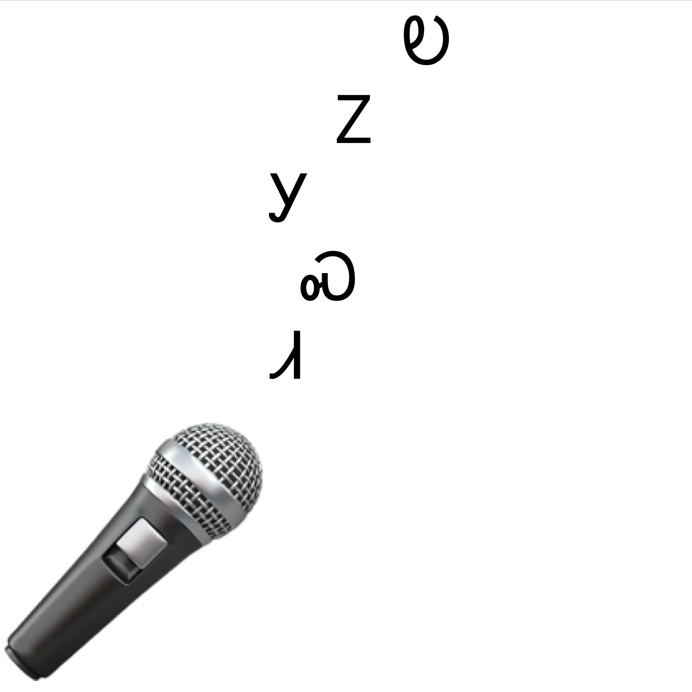
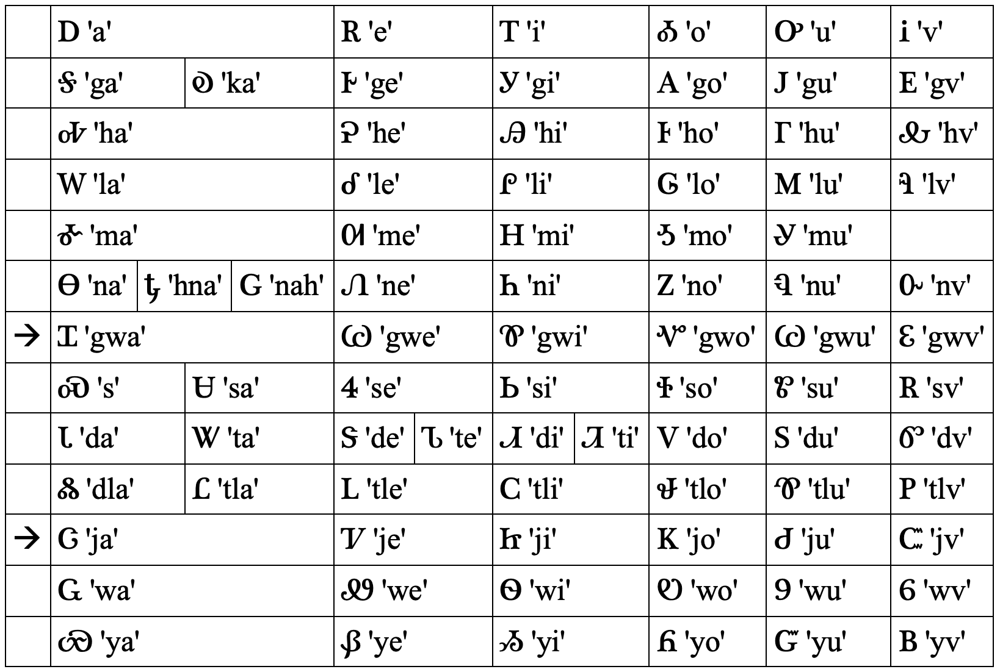

# ᎧᏃᎩᏍᏗ/Kanogisdi 🎙️🎵

ᎧᏃᎩᏍᏗ/Kanogisdi (/kʰanoːkiːsti/ 'singing') is a Cherokee UTAUloid, which can be used to create synthesized vocal music in the Cherokee language. Kanogisdi should work with any UTAU-compatible software, but was designed with [OpenUtau](http://www.openutau.com) in mind.

## Using Kanogisdi

To get started:

1. Download the latest version of Kanogisdi (`Kanogisdi_v0-0-YYYYMMDD.zip`) from this repository above, and read the license ([`LICENSE.md`](https://github.com/morgansleeper/Kanogisdi/blob/main/LICENSE.md)).
2. If you haven't already, download and install [OpenUtau](http://www.openutau.com)
3. Follow the instructions [here](https://github.com/stakira/OpenUtau/wiki/Getting-Started#install-a-voicebank) to install Kanogisdi as a voicebank! (Make sure to select 'UTF-8' as the 'Archive File Encoding')
4. Once installed, select Kanogisdi from the 'Select Singer' button on a track on the left, and choose the 'Default' phonemizer and 'Classic' renderer options
5. ᏘᏃᎩ!

## Syllable mapping

For **complete syllable mappings**, see [this chart](https://docs.google.com/spreadsheets/d/1Yb0HBqQLzD9vcHwfl2e7K4WyMroSroBJkK2BBHYEcK8/edit?usp=sharing)!

Click here for the ᏣᎳᎩ Syllabary chart with mappings for Kanogisdi

Note: syllabary rows marked with an arrow differ from the usual romanization system in order to better accommodate voiceless equivalents in the full syllable mapping of Kanogisdi (see link above).

## Examples
"ᎣᏏᏲ! ᎧᏃᎩᏍᏗ ᏓᏆᏙᎠ — ᎢᏓᎴᎾᏭ!"

https://github.com/morgansleeper/Kanogisdi/assets/28555666/31567b3c-6298-4246-a36a-b036a5f304c8

_More coming soon!_
